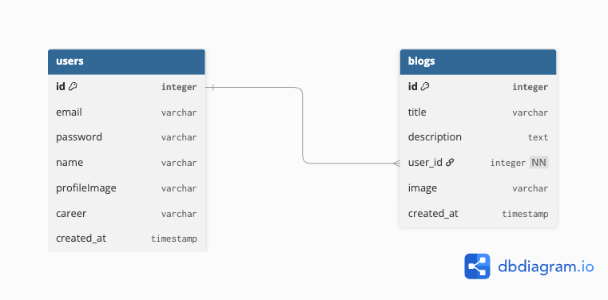
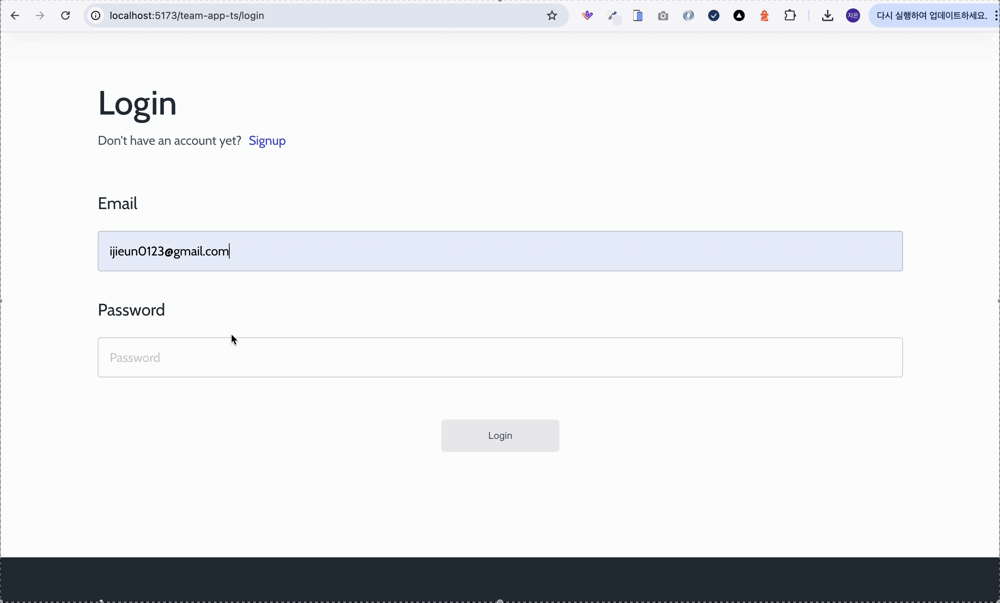

# 📝 Team App (Backend)

> **Team App은 원격 팀을 위한 즉각적인 협업 환경을 목표로 개발된 플랫폼입니다.**

디자이너와 개발자 등 커뮤니케이션이 중요한 팀 구성원들이 보다 빠르게 협업할 수 있는 시스템을 지향합니다.
현재는 서비스 초기 단계로, 플랫폼의 방향성과 철학을 소개하는 홈페이지, 최신 웹 디자인 트렌드를 공유하고 논의할 수 있는 블로그 기능이 구현되어 있습니다.

---

## ✅ 기술 스택

| 영역        | 사용 기술                                            |
|-----------|--------------------------------------------------|
| Language  | Java 17                                          |
| Framework | Spring Boot 3.x, Spring Data JPA                 |
| Build     | Maven                                            |
| DB        | H2                                          |
| Infra     | GitHub Actions           |
| ETC       | JWT 인증 구현 |

---

## 📌 주요 기능

### 🔐 인증
* 회원가입
* 로그인 (JWT 기반 인증)

### 📝 블로그
* 블로그 글 작성
* 블로그 글 수정
* 블로그 글 삭제
* 블로그 글 단건 조회
* 블로그 글 전체 조회 (목록)

---

## 📄 API 명세서

| 기능 | 메서드 |	URL| 	요청 데이터                       | 응답 코드                                                   | 	설명            |
|---|---|---|-------------------------------|---------------------------------------------------------|----------------|
| 회원가입|	POST|	/api/auth/signup| 	email, password, name, profileImage, career | 	201 Created, 400 Bad Request	                          | 회원가입 성공 / 유효성 검증 실패 시 
|로그인	|POST|	/api/auth/login | 	email, password	             | 200 OK, 401 Unauthorized, 400 Bad Request, 404 Not Found | 	로그인 성공 (JWT 반환) / 비밀번호 불일치 등 / 유효성 검증 실패 시 / 존재하지 않는 회원 
|블로그 글 생성|	POST	|/api/blogs| 	title, image, description    | 	201 Created, 401 Unauthorized, 400 Bad Request	        | 블로그 글 작성 / 로그인 필요 / 유효성 검증 실패 시 
|블로그 글 조회 (단건)	|GET	|/api/blogs/{id}| 	없음	                          | 200 OK, 404 Not Found	| 특정 블로그 글 반환 / 존재하지 않을 경우 |
|블로그 글 조회 (전체)|	GET	|/api/blogs | 	없음                           |	200 OK| 	전체 블로그 글 목록 반환|
|블로그 글 수정|	PATCH	|/api/blogs/{id}| 	title, image,  description   |	200 OK, 401 Unauthorized, 403 Forbidden, 404 Not Found	|본인 글 수정 / 권한 없음 / 글 없음
|블로그 글 삭제|	DELETE	|/api/blogs/{id}	|없음|	204 No Content, 401 Unauthorized, 403 Forbidden, 404 Not Found 본인 | 글 삭제 / 권한 없음 / 글 없음|

---

## 🗂 ERD 설계

---

## ⚠️ 예외 처리

전역 예외 처리기를 통해 다음과 같은 에러를 일관적으로 관리합니다.

| 예외 코드               | 설명                   |
|----------------------|----------------------|
| `USER_NOT_FOUND`     | 사용자를 찾을 수 없습니다.      |
| `BLOG_NOT_FOUND`     | 블로그 글을 찾을 수 없습니다.    |
| `INVALID_PASSWORD`   | 비밀번호가 올바르지 않습니다.     |
| `UNAUTHORIZED`       | 해당 요청에 대한 권한이 없습니다.| 
| `ACCESS_DENIED`      | 접근이 거부되었습니다.            |
| `INVALID_TOKEN`      | 토큰이 유효하지 않습니다.    |
| `EMAIL_DUPLICATED`| 이 이메일은 이미 사용 중입니다.   |
|`VALIDATION_ERROR` | 입력한 정보가 올바르지 않습니다.   |
|`UNAUTHENTICATED` | 로그인되지 않은 사용자입니다.     |

예외는 `GlobalExceptionHandler` 에서 `ResponseEntity<ErrorResponse>` 형태로 처리됩니다.

---

## ⚠️ 유효성 검사

| 에러 코드 | 설명                   |
|-------|----------------------|
|`REQUIRED_EMAIL` | 이메일은 필수입니다. |
|`INVALID_EMAIL_FORMAT`|이메일 형식이 아닙니다.|
|`REQUIRED_PASSWORD`|비밀번호는 필수입니다.|
|`INVALID_PASSWORD_LENGTH`|비밀번호는 8~20자 사이여야 합니다.|
|`REQUIRED_NAME`|이름은 필수입니다.|
|`INVALID_NAME_LENGTH`|이름은 2~20자 사이여야 합니다.|
|`REQUIRED_JOB`|직업은 필수입니다.|
|`INVALID_CAREER_LENGTH`|경력 정보는 최대 100자까지 가능합니다.|
|`REQUIRED_TITLE`|제목은 필수입니다.|
|`INVALID_TITLE_LENGTH`|제목은 100자 이하로 입력해주세요.|
|`REQUIRED_CONTENT`|본문은 필수입니다.|

---

## 🎨 피그마(Figma)

> 🔗 [피그마 디자인 보기](https://www.figma.com/design/70K7HCVIsWTcIM9N1iwOTW/Blog-Design-%EC%B5%9C%EC%A2%85-2?node-id=1517-2&t=053ZwnJWDmJuXOcd-1)

---

## 🚀 이미지

### 회원가입
;

### 로그인
;

### 블로그 글 생성
;

### 블로그 글 수정
;

### 블로그 글 삭제
;
